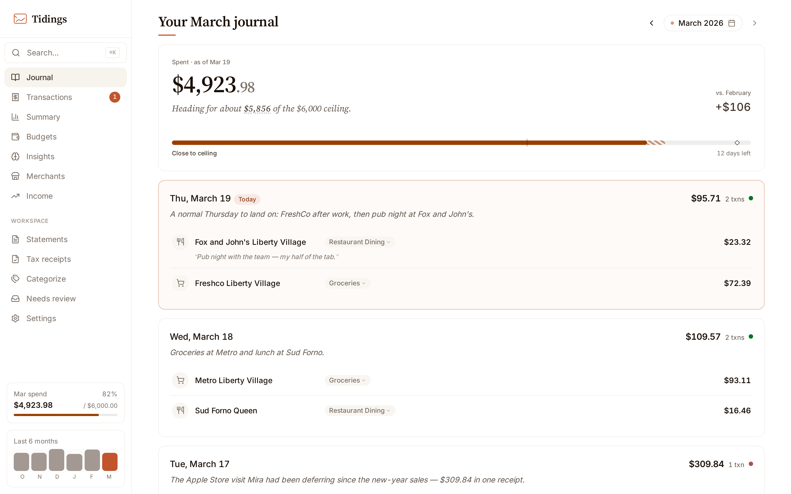
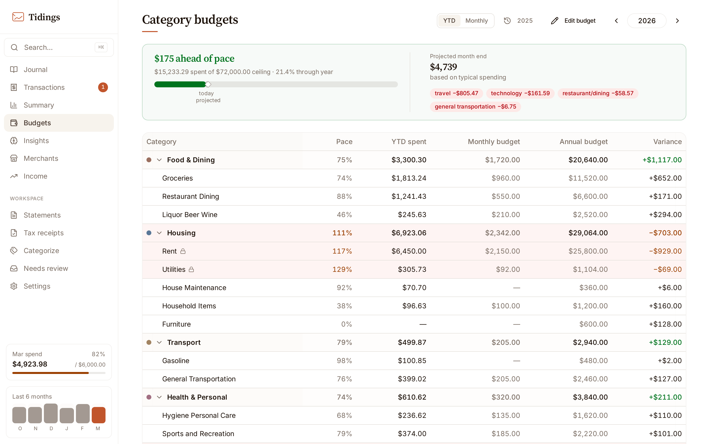
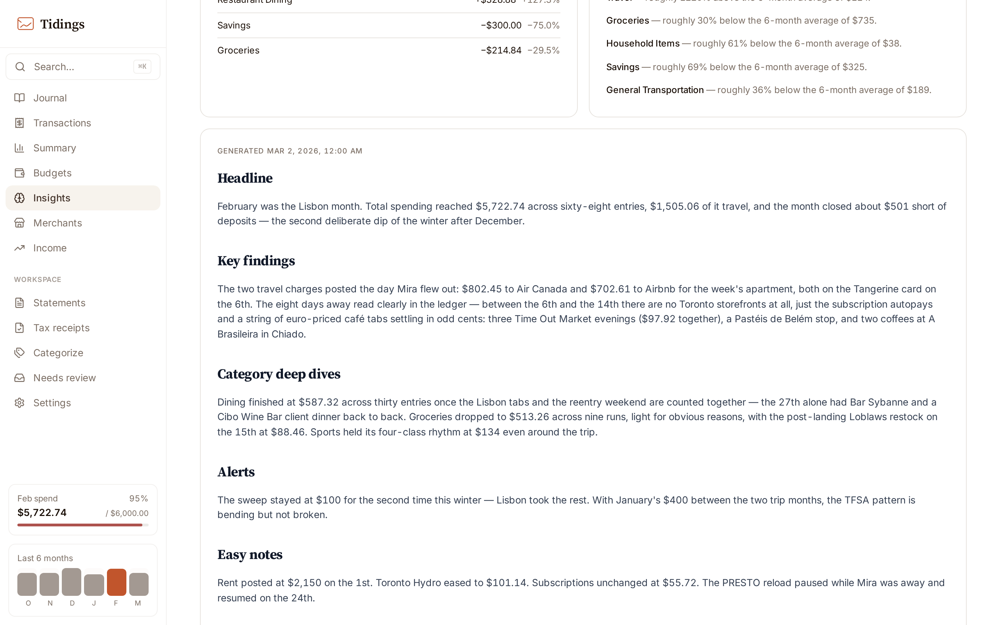
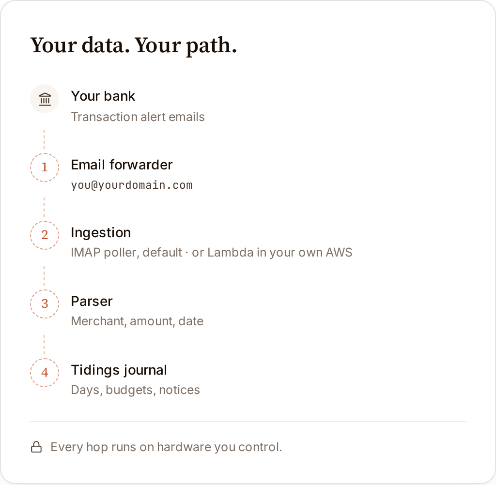

<p align="center">
  <picture>
    <source media="(prefers-color-scheme: dark)" srcset="docs/static/readme/hero-banner-dark.webp" type="image/webp">
    <source media="(prefers-color-scheme: dark)" srcset="docs/static/readme/hero-banner-dark.jpg">
    <source srcset="docs/static/readme/hero-banner-light.webp" type="image/webp">
    
  </picture>
</p>

<p align="center">
  <strong>Your spending, delivered.</strong><br>
  A private finance journal from the transaction emails you already receive — self-hosted, no bank credentials, no manual entry.
</p>

<p align="center">
  <a href="LICENSE"></a>
  <a href="https://github.com/tvhahn/tidings/actions/workflows/ci.yml"></a>
  <a href="CHANGELOG.md"></a>
</p>

<p align="center">
  <a href="https://gettidings.com/demo"><strong>Live demo</strong></a> ·
  <a href="#quickstart">Quickstart</a> ·
  <a href="https://docs.gettidings.com">Docs</a> ·
  <a href="#bank-support">Bank support</a> ·
  <a href="CONTRIBUTING.md">Contributing</a>
</p>

<p align="center">
  <a href="https://gettidings.com/demo">
    <picture>
      <source media="(prefers-color-scheme: dark)" srcset="docs/static/readme/journal-dark.webp" type="image/webp">
      <source media="(prefers-color-scheme: dark)" srcset="docs/static/readme/journal-dark.png">
      <source srcset="docs/static/readme/journal-light.webp" type="image/webp">
      
    </picture>
  </a>
  <br>
  <sub>The journal, captured from the <a href="https://gettidings.com/demo">live demo</a>.</sub>
</p>

Forward your bank's transaction alerts to an inbox you control. Tidings reads them, parses each one, and files it into a calm daily journal — with budgets to pace the year and notifications when something lands. Your data stays on your machine.

Built for a single household. Parsers for five Canadian banks ship today — RBC, CIBC, MBNA, Simplii, PC Financial. Alerts from other banks can be rescued with AI extraction, and any bank that emails transaction alerts can be added by [writing a parser](docs/guides/add-a-parser.md).

---

## Quickstart

Three commands and a browser tab:

```bash
git clone https://github.com/tvhahn/tidings.git
cd tidings
docker compose up -d
```

Open <http://localhost:8000>. (No published image for your platform yet? The same command builds from source instead — first run takes a few minutes.)

### 🤖 Or hand it to an agent

Paste one line into Claude Code, Cursor, Codex — any capable coding agent:

```text
Help me install Tidings. Read https://docs.gettidings.com/install.md first, then walk me through it.
```

That URL serves [`INSTALL.md`](INSTALL.md), written as a prompt rather than a script: the agent reads your machine, branches on OS / Docker / AWS, asks you one question, and verifies the install before handing you the URL.

Not ready to install anything? Have an agent give you the tour instead. The demo journal is served read-only at a public endpoint, OpenAPI schema alongside, so an agent can pull real sample data and narrate it:

```text
Introduce me to Tidings. Read https://docs.gettidings.com/agent-guide.md, then use the live demo API to show me what a month of spending looks like.
```

Agents stay useful after install, too — every route is a versioned `/api/v1/` endpoint with bearer-token auth. The machine-readable surfaces are catalogued in [Tidings for agents](https://docs.gettidings.com/for-agents/).

### Wire up your own data

The default is demo mode — a seeded SQLite database (`data/demo.db`) of sample transactions. No real accounts, no IMAP connection. Click around, then wire up your own data once the shape feels right:

1. **Email** — copy `.env.example` to `.env` and add Gmail IMAP credentials. The [email setup guide](docs/guides/self-hosted-email-setup.md) covers the dedicated account, the App Password, and per-bank alert settings.
2. **Timezone** — set yours under Settings → Timezone; "Detect from browser" picks it in a click. The default is `America/Los_Angeles`.
3. **Notifications** — pick a provider in the [notifications guide](docs/guides/notifications-setup.md). The recommended default is ntfy: free, no account, works on iOS and Android.
4. **Leave demo mode** — set `demo_mode: false` in `data/config.json` (the container writes this file into its `finance_data` volume on first run, so edit it there rather than expecting it in a fresh checkout). Your transactions live in `data/finance.db`; the seeded demo data stays in its own database and never mixes with yours.

Contributing rather than self-hosting? Use VS Code's "Reopen in Container" or `docker compose -f .devcontainer/docker-compose.yml up` for the dev environment — the root `docker compose up` is the self-hoster stack.

---

## Running it for real

- **Access** — first run is trust-on-first-use: the dashboard works without a password and prompts you to set one under Settings → Password. It is built for loopback or a network you control — Tailscale, a LAN behind your firewall — and is not meant to face the open internet. API access from other devices uses bearer tokens; the [agent access guide](docs/guides/agent-access.md) covers issuing them and the LAN-exposure checklist.
- **Upgrades** — `docker compose pull && docker compose up -d`. Pre-1.0, a minor version may change schemas — read the [`CHANGELOG`](CHANGELOG.md) before pulling, and take a backup first. The [upgrading guide](docs/guides/upgrading.md) covers migrations and rolling back.
- **Backups** — one zip from Settings → Backup carries every transaction plus config, and restores with a dry-run preview. The [backup guide](docs/guides/backup-and-restore.md) covers the zip, full volume copies, and leaving cleanly.

---

## Privacy

By default, nothing leaves your machine. Run without an AI key and the pipeline never calls out — unparsed emails are held for review instead.

Add an OpenAI API key (or sign the Codex CLI into a ChatGPT subscription) and two switches under Settings → Intelligence come on, both yours to turn back off:

- **AI categorization** sends two things per transaction: the amount and the merchant name. Account numbers, card numbers, balances, and every other transaction stay on your machine.
- **Email rescue** sends the subject and body of an email no parser could read, so the model can recover the transaction.

The other AI features — the monthly briefing, receipt reading, statement parsing — are separate opt-ins under Settings → Intelligence, each off until you enable it; a key alone never turns them on. Each feature routes to the provider you pick for it (the OpenAI API, or a Claude / Codex / Gemini CLI already installed on your machine); enable a feature and that provider sees only that feature's data.

Full breakdown: [AI categorization](docs/guides/self-hosted-email-setup.md#ai-categorization-optional).

---

## Features

- **Email-first ingestion** — an IMAP poller picks up alerts within a minute of arrival and never files the same transaction twice.
- **Five Canadian banks out of the box** — email alerts for all, PDF statements for some; the full grid is under [Bank support](#bank-support).
- **Budgets, briefings, and search** — annual category targets with monthly pace, an AI-written monthly briefing, full-text search, bulk edit.
- **Receipts and a tax pack** — attach receipt photos to transactions, have your AI provider read them (opt-in), and download a year's claimable spending as CSVs with the evidence files bundled in.
- **Private by construction** — the database lives on your disk; AI categorization is off without a key.
- **Notifications** — ntfy (recommended) or AWS SNS, auto-detected from your environment; Twilio SMS via an explicit opt-in.
- **SQLite by default, DynamoDB for AWS** — same parsers, two storage backends, selected in `data/config.json`.
- **FastAPI + React** — versioned `/api/v1/` routes with a unified error shape and Swagger UI at `/docs`. The dashboard ships prebuilt in the same container.

<table>
  <tr>
    <td width="50%">
      <picture>
        <source media="(prefers-color-scheme: dark)" srcset="docs/static/readme/budgets-dark.webp" type="image/webp">
        <source media="(prefers-color-scheme: dark)" srcset="docs/static/readme/budgets-dark.png">
        <source srcset="docs/static/readme/budgets-light.webp" type="image/webp">
        
      </picture>
    </td>
    <td width="50%">
      <picture>
        <source media="(prefers-color-scheme: dark)" srcset="docs/static/readme/insights-dark.webp" type="image/webp">
        <source media="(prefers-color-scheme: dark)" srcset="docs/static/readme/insights-dark.png">
        <source srcset="docs/static/readme/insights-light.webp" type="image/webp">
        
      </picture>
    </td>
  </tr>
  <tr>
    <td align="center"><sub>Budgets — annual targets with monthly pace</sub></td>
    <td align="center"><sub>Insights — an AI-written monthly briefing</sub></td>
  </tr>
</table>

---

## Bank support

| Institution    | Email alerts | PDF statements | Notes                                  |
|----------------|:------------:|:--------------:|----------------------------------------|
| RBC            | Yes          | Yes (chequing) | Purchase, withdrawal, e-transfer       |
| CIBC           | Yes          | No             | Purchase, preauth payment              |
| MBNA           | Yes          | No             | Credit card purchase                   |
| Simplii        | Yes          | Yes (chequing) | E-transfer (Interac sender)            |
| PC Financial   | Yes          | No             | Money Account purchase alerts          |

Don't see your bank? [Add a parser](docs/guides/add-a-parser.md) — the most useful contribution to the project. The tutorial walks from zero to a working example, and it's a task an agent does well: point yours at the tutorial with a redacted alert email from your bank.

<details>
<summary>Enabling bank alerts</summary>

Every supported bank offers real-time transaction alerts by email in its online-banking notification settings. Point them at a dedicated Gmail account, not your personal inbox — the poller reads that account on an interval. Non-alert mail is ignored; alerts from an unrecognized bank are captured in the Needs review queue rather than dropped. Per-bank details: [email setup guide](docs/guides/self-hosted-email-setup.md).

</details>

---

## Who it's for

Tidings is for you if you:

- keep a single household's finances and want them to stay on your own machine
- already get transaction alert emails from your bank, and would rather a parser read them than type entries by hand
- are comfortable running `docker compose up` and owning your data

Tidings is deliberately small — a journal of one household's spending, built from the emails your bank already sends. What stays out of scope is written down in [ROADMAP — Not doing](ROADMAP.md#not-doing).

### How it compares

Firefly III and Actual Budget are the established self-hosted finance tools — a full double-entry finance manager and a local-first envelope budgeting app, built around bank sync, file imports, or manual entry. Tidings is narrower: it builds a daily spending journal from the transaction alert emails your bank already sends. No bank credentials, nothing to type in. Pick one of those for accounting or envelope budgeting; pick Tidings for a record of spending that maintains itself.

---

## Architecture

<p align="center">
  <picture>
    <source media="(prefers-color-scheme: dark)" srcset="docs/static/readme/data-path-dark.webp" type="image/webp">
    <source media="(prefers-color-scheme: dark)" srcset="docs/static/readme/data-path-dark.png">
    <source srcset="docs/static/readme/data-path-light.webp" type="image/webp">
    
  </picture>
</p>

Two deployment shapes share the same parser pipeline:

- **Self-hosted (default)** — Docker Compose runs the FastAPI + React container plus an IMAP poller sidecar. SQLite on a shared volume. No cloud.
- **Serverless AWS (advanced)** — Amazon SES → S3 → Lambda → DynamoDB. Same parsers, same notifications, different storage and trigger. Run the Docker path unless you already live in AWS. See the [AWS deployment guide](docs/guides/aws-deployment.md).

Every config key is documented in [`docs/guides/configuration.md`](docs/guides/configuration.md). Services, schemas, and the parser contract: [`docs/ARCHITECTURE.md`](docs/ARCHITECTURE.md).

---

## Troubleshooting

Once it's running, the sync dot beside the month picker summarizes health at a glance — hover for last sync, latest transaction, and backend. `curl http://localhost:8000/api/v1/health` returns the full picture as JSON, version included (unauthenticated; suited to Uptime Kuma and similar monitors). The most common failure is a bank changing its email template: the dot goes stale, logs show `Failed to parse email`, and the fix is a [parser-broken issue](.github/ISSUE_TEMPLATE/parser_broken.md) with a redacted email body.

Everything else — status meanings, port conflicts, IMAP auth, `data/` permissions, Apple Silicon, a forgotten password — lives in the [troubleshooting guide](docs/guides/troubleshooting.md), and the [FAQ](docs/guides/faq.md) answers the questions that aren't failures.

Or hand the diagnosis to an agent:

```text
My Tidings install is misbehaving. Read https://docs.gettidings.com/troubleshooting.md, then help me diagnose it.
```

---

## Community

- **Docs** — [docs.gettidings.com](https://docs.gettidings.com): quickstart, self-hosting guides, architecture, API reference.
- **Contributing** — [`CONTRIBUTING.md`](CONTRIBUTING.md) for dev setup and PR conventions; the [add-a-parser tutorial](docs/guides/add-a-parser.md) is the best first contribution.
- **Roadmap** — [`ROADMAP.md`](ROADMAP.md): what's on the radar, and what stays out of scope.
- **Changelog** — [`CHANGELOG.md`](CHANGELOG.md): Keep a Changelog format, SemVer.
- **Conduct** — [`CODE_OF_CONDUCT.md`](CODE_OF_CONDUCT.md): Contributor Covenant.
- **Discussions** — "how do I…" and parser wishlists go to GitHub Discussions; bugs and concrete feature requests go to Issues.

---

## Status

**v0.1.0 — pre-1.0.** APIs and schemas may change between minor versions.

## License

MIT — see [LICENSE](LICENSE).
